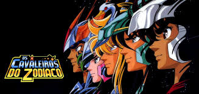

# 2024.2_Cavaleiros_do_Zodiaco
<center>




Figura 1 - Logo do desenho

</center>

## Sobre o projeto

Projeto criado para a disciplina de Sistema de Banco de Dados 1 ministrada pelo professor Mauricio Serrano. Neste projeto, será desenvolvido um jogo MUD onde os conceitos de bancos de dados serão aplicados. Ao fim do projeto, será entregue um jogo funcional inspirado no famoso desenho Cavaleiros do Zodiaco criado pelo Masami Kurumada.

## 📁 Entregas

- Modulo 1:

  - [Modelo Entidade Relacionamento]()

  - [Diagrama Entidade Relacionamento]()

  - [Modelo Lógico]()

  - [Diagrama de dados]()

## 🎥 Apresentações
<center>

| Módulo | Link da gravação             | Data       |
| ------ | --------------------- ------- | ---------- |
| 1      | [Apresentação Módulo 1]()    | - |
| 2      | [Apresentação Módulo 2]()    | - |
| 3      | [Apresentação Módulo 3]()    | - |
  
</center>

## Como Rodar o Jogo

1. Certifique-se de que o Docker está instalado e funcionando corretamente.

2. Navegue para o diretório `game`:

   ```
   cd game

   ```

3. Inicie o servidor do banco de dados e execute as migrations com:

  ```
   docker-compose up --build
  ```
4. Inicie o jogo com:
   ```
   pip install --no-cache-dir -r requirements.txt
   ```
  ```
  python3 src/main.py
  ```
## Membros do grupo

<center>
<table>
  <tr>
    <td align="center"><a href="https://github.com/LucasAvelar2711"><br /><sub><b>Lucas Avelar</b></sub></a><br />
    <td align="center"><a href="https://github.com/lramon2001"><br /><sub><b>Lucas Ramon</b></sub></a><br />
    <td align="center"><a href="https://github.com/lucasdray"><br /><sub><b>Pedro Lucas Dourado</b></sub></a><br />
    <td align="center"><a href="https://github.com/andreozzi"><br /><sub><b>Victor Andreozzi</b></sub></a><br />
    <td align="center"><a href="https://github.com/RufinoVfR"><br /><sub><b>Vinicius Rufino</b></sub></a><br />

  </tr>
</table>
</center>


