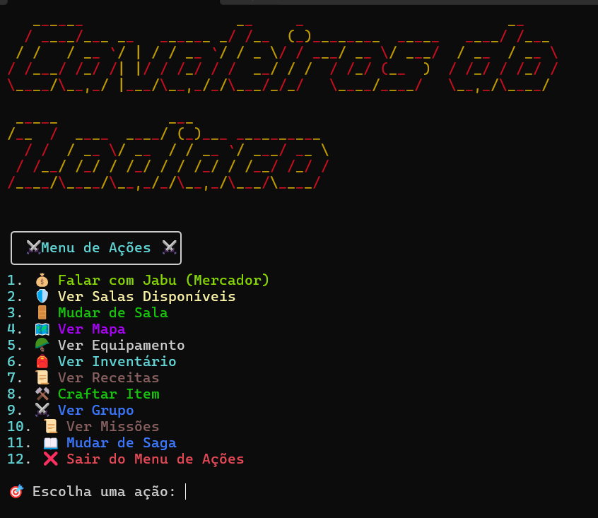

# 2024.2_Cavaleiros_do_Zodiaco

Figura 1 - Logo do desenho

## Sobre o projeto

Cavaleiros do Zodíaco é um MUD de RPG imersivo ambientado no universo dos Cavaleiros do Zodíaco, onde estratégia, exploração e batalhas épicas se unem para criar uma experiência única. Como um aspirante a Cavaleiro, você deve embarcar em missões desafiadoras, enfrentar inimigos formidáveis e evoluir suas habilidades para se tornar um verdadeiro protetor de Athena.

A jornada é repleta de escolhas estratégicas. Você pode formar uma party com até 3 cavaleiros diferentes para enfrentar desafios mais difíceis, batalhar contra grupos de inimigos e testar suas habilidades contra poderosos adversários. A cada missão completada, novos Cavaleiros são desbloqueados, permitindo que você aumente suas opções de combate e fortaleça seu time.

Além dos combates, a gestão de equipamentos é essencial. Desbloqueie o ferreiro Mu para reparar, melhorar ou desmontar armaduras, garantindo que sua defesa esteja sempre à altura dos desafios. O Mercador Jabu oferece um vasto leque de itens, permitindo que você compre e venda suprimentos valiosos para sua jornada.

O mundo de Cavaleiros do Zodíaco é dinâmico, evoluindo conforme as sagas se desenrolam. Novos eventos, inimigos e desafios surgem conforme você avança pelo mapa, explorando santuários, templos e arenas de batalha lendárias.

Com um sistema de movimentação tática, interações profundas com NPCs e mecânicas clássicas de RPG, Cavaleiros do Zodíaco oferece uma boa experiência envolvente para os fãs de aventuras baseadas em texto. Prepare-se para vestir sua armadura, desbloquear cavaleiros e lutar pelo destino do universo!

Figura 2 - Menu do jogo Cavaleiros do Zodíaco

Figura 2 - Primeiro Mapa Cavaleiros do Zodíaco

## Entregas

- Módulo 1:

  - [Modelo Entidade Relacionamento](./modulo01/mer.md)

  - [Diagrama Entidade Relacionamento](./modulo01/der.md)

  - [Modelo Lógico](./modulo01/ml.md)

  - [Dicionário de Dados](./modulo01/dicionario.md)

  - Módulo 02:
    
    - [DDL](./modulo02/DDL.md)

    - [DML](./modulo02/DML.md)

    - [DQL](./modulo02/DQL.md)

  - Módulo 03:

    - [Triggers](./modulo03/triggers.md)

## Apresentações

 - [Módulo 1](./apresentacao/modulo1.md)
 - [Módulo 2](./apresentacao/modulo2.md)
 - [Módulo 3](./apresentacao/modulo3.md)

## Membros do grupo

<table>
  <tr>
    <td align="center"><a href="https://github.com/LucasAvelar2711"> <b>Lucas Avelar</b></a> 
    <td align="center"><a href="https://github.com/lramon2001"> <b>Lucas Ramon</b></a> 
    <td align="center"><a href="https://github.com/lucasdray"> <b>Pedro Lucas Dourado</b></a> 
    <td align="center"><a href="https://github.com/andreozzi"> <b>Victor Andreozzi</b></a> 
    <td align="center"><a href="https://github.com/RufinoVfR"> <b>Vinicius Rufino</b></a> 

  </tr>
</table>

