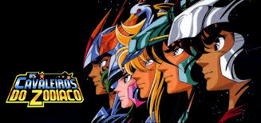

# 2024.2_Cavaleiros_do_Zodiaco

Figura 1 - Logo do desenho

## Sobre o projeto

Projeto criado para a disciplina de Sistema de Banco de Dados 1 ministrada pelo professor Mauricio Serrano. Neste projeto, será desenvolvido um jogo MUD onde os conceitos de bancos de dados serão aplicados. Ao fim do projeto, será entregue um jogo funcional inspirado no famoso desenho Cavaleiros do Zodiaco criado pelo Masami Kurumada.

## Entregas

- Módulo 1:

  - [Modelo Entidade Relacionamento](../docs/modulo01/mer.md)

  - [Diagrama Entidade Relacionamento](../docs/modulo01/der.md)

  - [Modelo Lógico](../docs/modulo01/ml.md)

  - [Dicionário de Dados](../docs/modulo01/dicionario.md)

  - Módulo 02:
    
    - [DDL](../docs/modulo02/DDL.md)

    - [DML](../docs/modulo02/DML.md)

    - [DQL](../docs/modulo02/DQL.md)

  - Módulo 03:

    - [Triggers](../docs/modulo03/Triggers.md)

## Apresentações

 - [Módulo 1](../docs/apresentacao/modulo1.md)
 - [Módulo 2](../docs/apresentacao/modulo2.md)
 - [Módulo 3](../docs/apresentacao/modulo3.md)

## Membros do grupo

<table>
  <tr>
    <td align="center"><a href="https://github.com/LucasAvelar2711"> <b>Lucas Avelar</b></a> 
    <td align="center"><a href="https://github.com/lramon2001"> <b>Lucas Ramon</b></a> 
    <td align="center"><a href="https://github.com/lucasdray"> <b>Pedro Lucas Dourado</b></a> 
    <td align="center"><a href="https://github.com/andreozzi"> <b>Victor Andreozzi</b></a> 
    <td align="center"><a href="https://github.com/RufinoVfR"> <b>Vinicius Rufino</b></a> 

  </tr>
</table>

