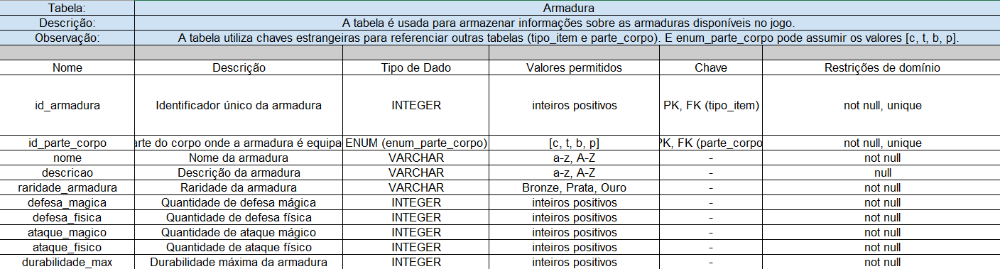
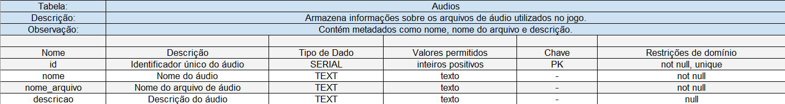

# Dicionário de Dados

## Introdução
Segundo Elmasri e Navathe1, a modelagem conceitual é uma etapa essencial no desenvolvimento de uma aplicação de banco de dados bem-sucedida. Essa fase abrange o design de estruturas e restrições do banco de dados, além da criação de programas que realizam consultas e atualizações. A modelagem conceitual não apenas facilita a compreensão e o planejamento do banco de dados, mas também garante que as operações sejam eficientes e seguras.

## Objetivo
Este documento tem como objetivo detalhar as tabelas, colunas e relacionamentos do banco de dados no contexto do modelo de dados físico. Ele descreve cada entidade do sistema, suas restrições e as relações entre elas, conforme definido no processo de modelagem conceitual. A representação gráfica deste modelo pode ser visualizada no artefato de Diagrama Entidade-Relacionamento (DER), que serve como base para a implementação deste dicionário de dados.
## Tabelas e Relações

# Dicionário de Dados
 Aqui, colocamos as tabelas do dicionário de dados usando o excel.

## Tabelas e Relações

### Tabela: **Armadura**

### Tabela: **Armadura equipada**

### Tabela: **Audios**

## Tabela: **Boss**

### Tabela: **Cavaleiro**

### Tabela: **Classe**

### Tabela: **Consumível**

### Tabela: **Custos ferreiro**

### Tabela: **Elemento**

### Tabela: **Ferreiro**

### Tabela: **Flyway_Schema_History**

### Tabela: **Grupo inimigo**

### Tabela: **Habilidade**

### Tabela: **Habilidade Boss**

### Tabela: **Habilidade Cavaleiro**

### Tabela: **Habilidade inimigo**

### Tabela: **Habilidade Player**

### Tabela: **inimigo**

### Tabela: **Instância Cavaleiro**

### Tabela: **Instância inimigo**

### Tabela: **Inventário**

### Tabela: **Item a venda**

### Tabela: **Habilidade Cavaleiro**

### Tabela: **Item Armazenado**

### Tabela: **Item grupo inimigo dropa**

### Tabela: **Item missão**

### Tabela: **Livro**

### Tabela: **Material**

### Tabela: **Material Necessário Ferreiro**

### Tabela: **Material receita**

### Tabela: **Mercador**

### Tabela: **Npc**

### Tabela: **Missão**

### Tabela: **Parte Corpo**

### Tabela: **Parte Corpo Boss**

### Tabela: **Parte Corpo Cavaleiro**

### Tabela: **Parte corpo inimigo**

### Tabela: **Parte corpo player**

### Tabela: **Party**

### Tabela: **Player**

### Tabela: **Player Missão**

### Tabela: **Quest**

### Tabela: **Receita**

### Tabela: **Saga**

### Tabela: **Sala**

### Tabela: **Sala segura**

### Tabela: **Tipo item**

### Tabela: **Tipo npc**

### Tabela: **Tipo Personagem**

### Tabela: **xp ncessária**

### Tabela: **receita**

## Relacionamentos

- **Instancia_Cavaleiro**:
  - `id_cavaleiro` → `Cavaleiro(id_cavaleiro)`
  - `id_party` → `Party(id_player)`

- **Elemento**:
  - `fraco_contra` → `Elemento(id_elemento)`
  - `forte_contra` → `Elemento(id_elemento)`

- **Progresso_Player**:
  - `id_player` → `Player(id_player)`
  - `id_boss` → `Boss(id_boss)`
  - `id_cavaleiro` → `Cavaleiro(id_cavaleiro)`

- **Receita**:
  - N/A

- **Player_Missao**:
  - `id_player` → `Player(id_player)`
  - `id_missao` → `Missao(id_missao)`

- **Xp_Necessaria**:
  - N/A

- **Material_Receita**:
  - `id_receita` → `Receita(id_item_gerado)`
  - `id_material` → `Material(id_material)`

- **Habilidade_Player**:
  - `id_player` → `Player(id_player)`
  - `id_habilidade` → `Habilidade(id_habilidade)`

- **Habilidade_Cavaleiro**:
  - `id_cavaleiro` → `Cavaleiro(id_cavaleiro)`
  - `id_habilidade` → `Habilidade(id_habilidade)`

- **Habilidade_Boss**:
  - `id_boss` → `Boss(id_boss)`
  - `id_habilidade` → `Habilidade(id_habilidade)`

- **Parte_Corpo_Boss**:
  - `id_boss` → `Boss(id_boss)`
  - `parte_corpo` → `Parte_Corpo(id_parte_corpo)`

- **Parte_Corpo_Cavaleiro**:
  - `id_cavaleiro` → `Cavaleiro(id_cavaleiro)`
  - `parte_corpo` → `Parte_Corpo(id_parte_corpo)`
  - `id_instancia_cavaleiro` → `Instancia_Cavaleiro(id_instancia_cavaleiro)`

- **Player**:
  - `id_elemento` → `Elemento(id_elemento)`

- **Parte_Corpo_Player**:
  - `id_player` → `Player(id_player)`
  - `parte_corpo` → `Parte_Corpo(id_parte_corpo)`
  - `armadura_equipada` → `Armadura(id_armadura)`
  - `instancia_armadura_equipada` → `Armadura_Instancia(id_instancia)`

- **Elemento_Boss**:
  - `id_elemento` → `Elemento(id_elemento)`
  - `id_boss` → `Boss(id_boss)`

- **Habilidade_Inimigo**:
  - `id_habilidade` → `Habilidade(id_habilidade)`
  - `id_player` → `Inimigo(id_inimigo)`

- **Item_Armazenado**:
  - `id_inventario` → `Inventario(id_player)`
  - `id_item` → `Tipo_Item(id_item)`

- **Item_grupo_inimigo_dropa**:
  - `id_item` → `Tipo_Item(id_item)`
  - `id_grupo_inimigo` → `Grupo_inimigo(id_grupo)`

- **Classe**:
  - N/A

- **Habilidade**:
  - `classe_habilidade` → `Classe(id_classe)`
  - `elemento_habilidade` → `Elemento(id_elemento)`

- **Tipo_Item**:
  - N/A

- **Armadura**:
  - `id_parte_corpo` → `Parte_Corpo(id_parte_corpo)`

- **Material**:
  - N/A

- **Item_Missao**:
  - N/A

- **Consumivel**:
  - N/A

- **Livro**:
  - `id_habilidade` → `Habilidade(id_habilidade)`

- **Missao**:
  - `id_missao_anterior` → `Missao(id_missao)`
  - `item_necessario` → `Item_Missao(id_item)`

- **Santuario**:
  - `id_missao_requisito` → `Missao(id_missao)`
  - `id_missao_proximo_santuario` → `Missao(id_missao)`

- **Casa**:
  - `id_santuario` → `Santuario(id_santuario)`
  - `id_missao_requisito` → `Missao(id_missao)`
  - `id_missao_proxima_casa` → `Missao(id_missao)`

- **Sala**:
  - `id_casa` → `Casa(id_casa)`

- **Npc_Ferreiro**:
  - `id_sala` → `Sala(id_sala)`
  - `id_missao_desbloqueia` → `Missao(id_missao)`

- **Npc_Quest**:
  - `id_sala` → `Sala(id_sala)`

- **Npc_Mercador**:
  - `id_sala` → `Sala(id_sala)`

 - **Inimigo**:
  - `id_elemento` → `Elemento(id_elemento)`
  - `id_classe` → `Classe(id_classe)`

- **Instancia_Inimigo**:
  - `id_inimigo` → `Inimigo(id_inimigo)`
  - `id_grupo` → `Grupo_inimigo(id_grupo)`

- **Grupo_inimigo**:
  - `id_sala` → `Sala(id_sala)`

- **Inventario**:
  - `id_player` → `Player(id_player)`

- **Armadura_Instancia**:
  - `id_armadura`, `id_parte_corpo_armadura` → `Armadura(id_armadura, id_parte_corpo)`
  - `id_inventario` → `Inventario(id_player)`

- **Item_a_venda**:
  - `id_item` → `Tipo_Item(id_item)`

- **Party**:
  - `id_sala` → `Sala(id_sala)`

### Tipo: **tipo_item**
Representa os tipos de itens no sistema.

| Valor | Significado     |
|-------|-----------------|
| `a`   | armadura        |
| `m`   | material        |
| `i`   | item_missao     |
| `c`   | consumivel      |
| `l`   | livro           |

---

### Tipo: **parte_corpo**
Representa as partes do corpo.

| Valor | Significado     |
|-------|-----------------|
| `c`   | cabeça          |
| `t`   | tronco          |
| `b`   | braços          |
| `p`   | pernas          |

---

### Tipo: **enum_tipo_item**
Representa os tipos de itens no sistema.

| Valor | Significado     |
|-------|-----------------|
| `a`   | armadura        |
| `m`   | material        |
| `i`   | item_missao     |
| `c`   | consumivel      |
| `l`   | livro           |

---

### Tipo: **enum_parte_corpo**
Representa as partes do corpo.

| Valor | Significado     |
|-------|-----------------|
| `c`   | cabeça          |
| `t`   | tronco          |
| `b`   | braços          |
| `p`   | pernas          |

---